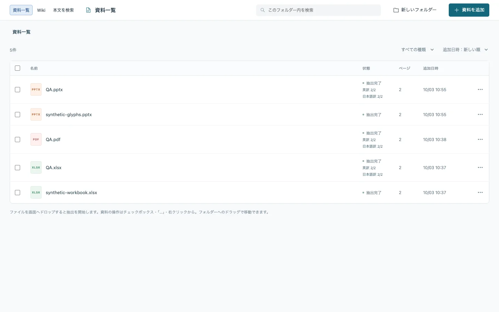
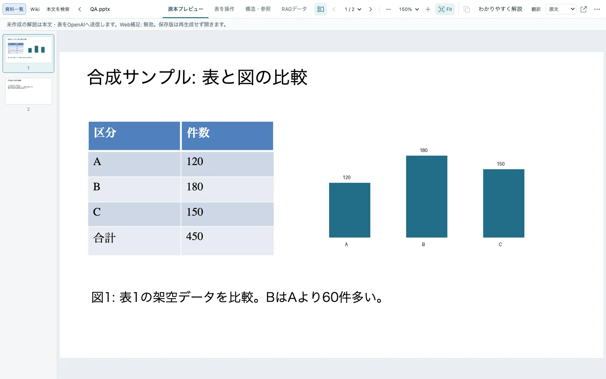
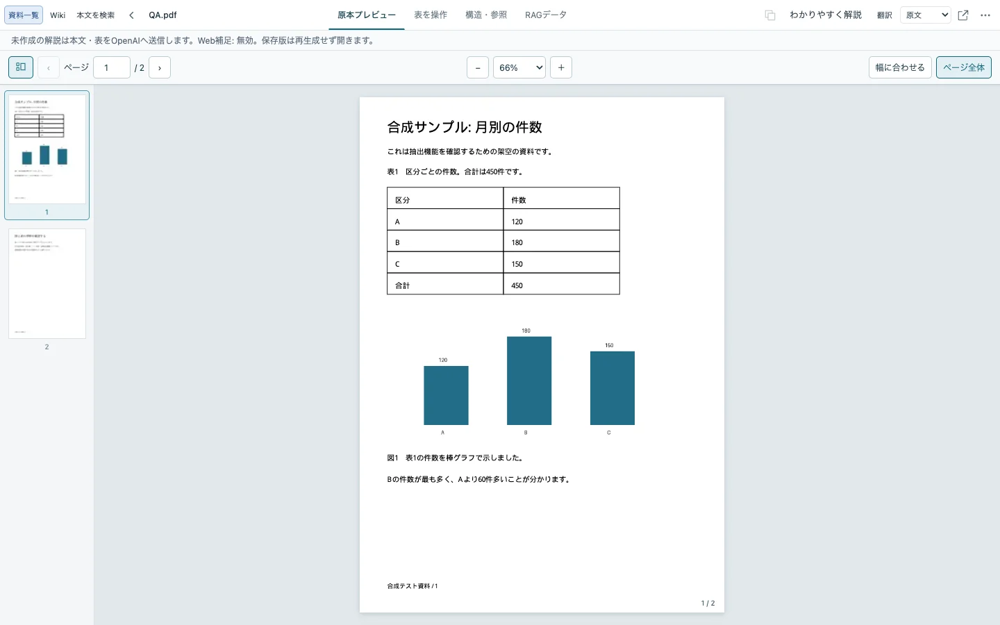
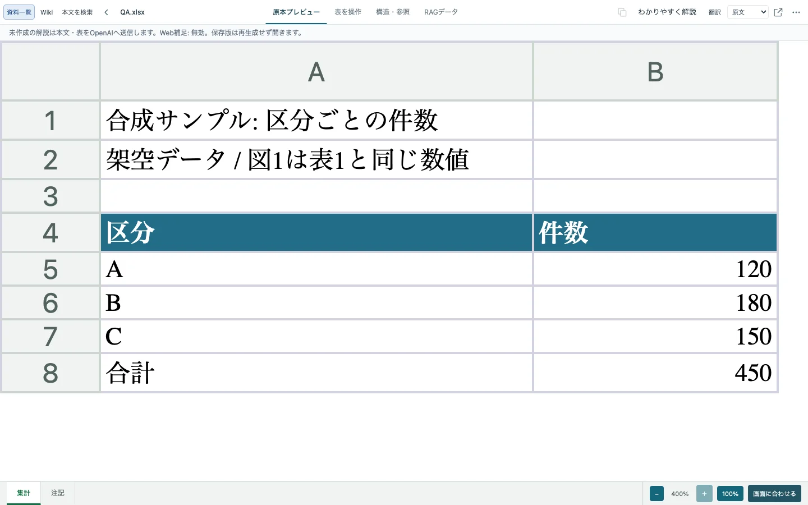
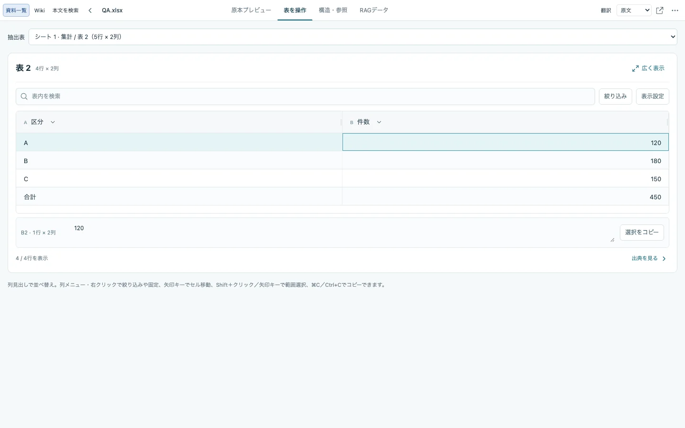
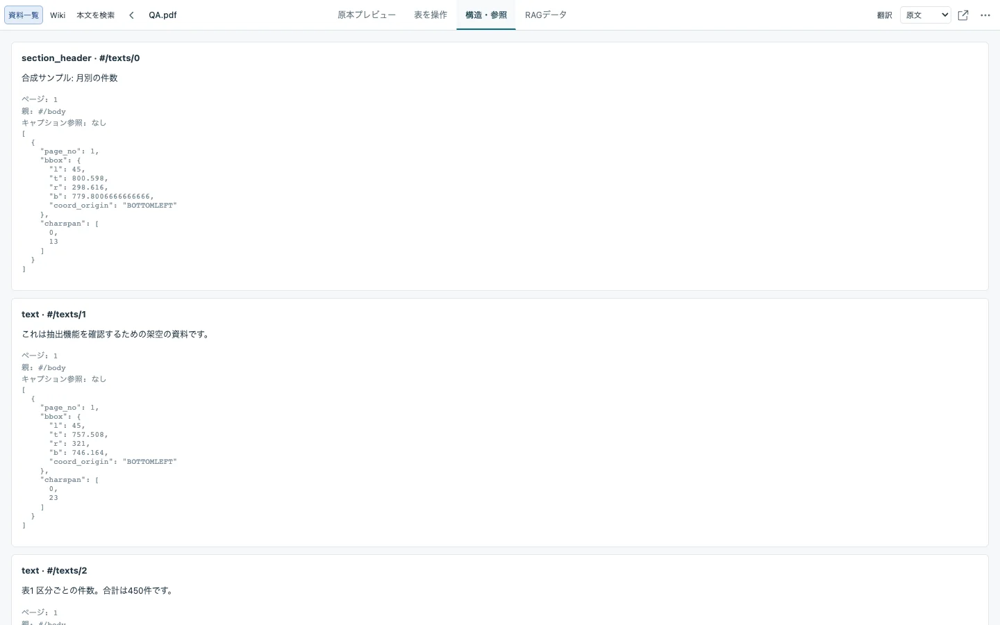
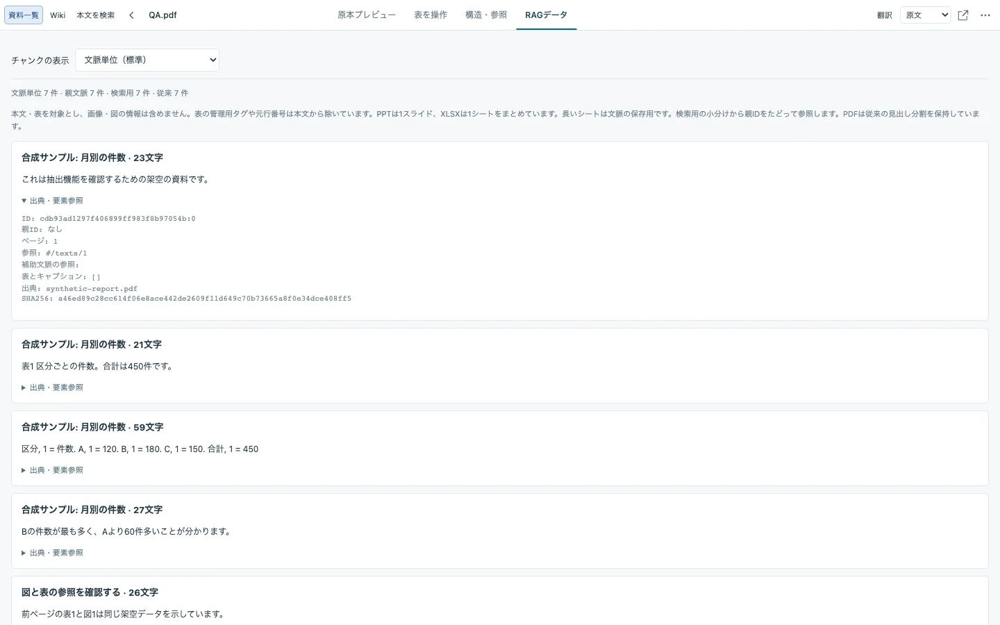
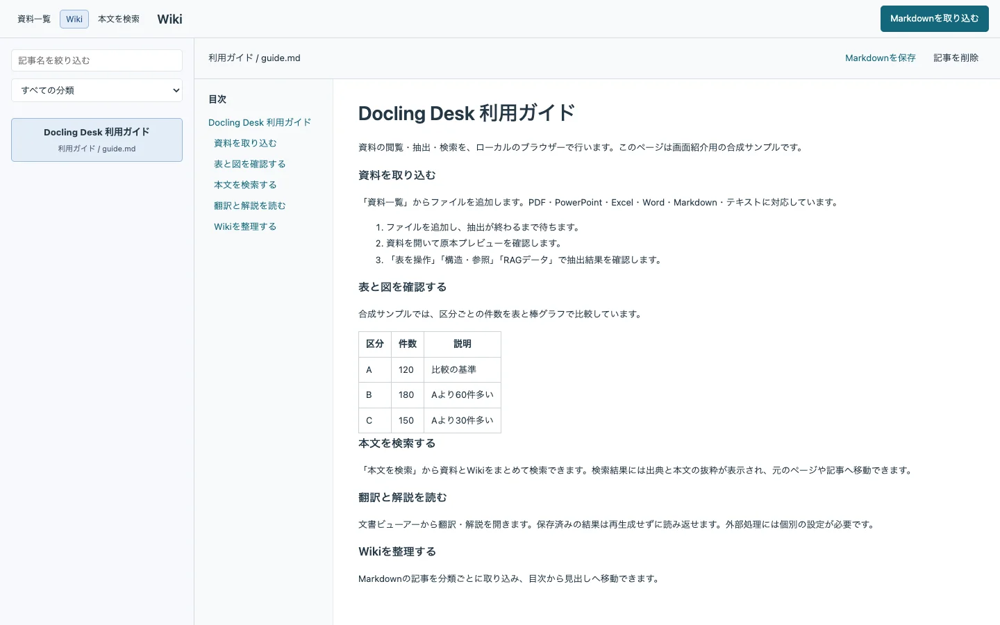
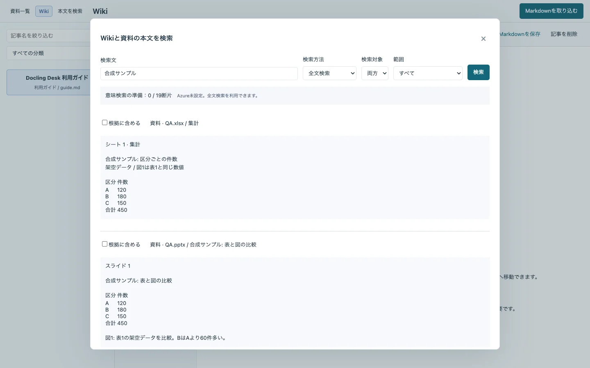

# Docling Desk

PDF・PowerPoint・Excel・Word・Markdown・テキストを、ローカルのブラウザーで閲覧・抽出・検索するアプリです。原本プレビューと、表・構造・出典付きのRAGデータを確認できます。Wiki取り込み、翻訳、解説、外部アプリ向けのナレッジAPIも備えています。

- Python 3.12–3.14。macOS、Linuxを対象にしています。
- 通常の画面はループバックで動作します。認証なしのローカル画面をインターネットへ公開しないでください。
- モデルは初回に取得し、その後の抽出はローカルで動作します。Azure OCR・embedding・翻訳などの外部処理は個別の設定が必要です。
- 本体は [MIT](LICENSE)。依存物・モデル・フォントの条件は [NOTICE](NOTICE.md) を参照してください。

## 主な画面

公開用の合成資料・記事を使った実際の画面です。画像はすべて非可逆圧縮のWebPです。

### 資料一覧

資料の種類、抽出状況、ページ数、保存済みの翻訳を一覧で確認できます。



### 文書プレビュー

PowerPointはスライドのレイアウトを保って表示し、サムネイルから移動・拡大できます。



<details>
<summary>PDF・Excelのプレビューを見る</summary>

PDFはページのサムネイルと倍率操作を備え、ページ全体または幅に合わせて表示できます。



Excelはシートを切り替えて閲覧し、表示倍率を調整できます。



</details>

<details>
<summary>抽出した表・文書構造・RAGデータを見る</summary>

抽出した表は、範囲選択・コピー、並べ替え、絞り込みができます。出典から原本も確認できます。



「構造・参照」では、本文要素の種類、ページ、親要素、原本内の位置を確認できます。



「RAGデータ」では、抽出本文を文脈単位で読み、各チャンクの出典と要素参照を確認できます。



</details>

### Wiki

Markdownの記事を分類ごとに取り込み、目次から見出しへ移動できます。



### 本文検索

資料とWikiをまとめて検索し、本文の抜粋と出典を確認できます。選んだ本文からRAGの根拠も取得できます。



## 起動

Linuxでの導入は [Docker手順](docs/linux-docker.md) を参照してください。

```sh
git clone --recurse-submodules https://github.com/ugnoguchigxp/docling-desk.git docling-desktop
cd docling-desktop
docker compose up -d --build --wait
```

http://127.0.0.1:18765 で開けます。macOSの原本プレビューはQuick Lookを使用し、PowerPointのPDF書き出しにはMicrosoft PowerPointが必要です。LinuxはLibreOfficeとTesseractを使用します。

## ソースから導入

Python 3.12以上とNode.js 22.12以上、pnpm 10.24.0が必要です。LinuxはDockerを推奨します。以下はmacOSでの手順です。

```sh
git clone --recurse-submodules https://github.com/ugnoguchigxp/docling-desk.git docling-desktop
cd docling-desktop
python3.12 -m venv .venv
.venv/bin/python -m pip install -r requirements-lock.txt
.venv/bin/python -m pip install --no-deps ./docling ./packages/docling-azure-ocr
.venv/bin/python -m pip install --no-deps --no-build-isolation -e .
pnpm --dir frontend install --frozen-lockfile
pnpm --dir frontend build
pnpm --dir frontend export:static
.venv/bin/python -m docling_desk.operations.download_models
.venv/bin/python -m docling_desk.operations.models
./run.sh
```

http://127.0.0.1:8765 で開けます。仮想環境を有効にしなくても、各コマンドは同じPython環境を使用します。

設定は `.env.example` を参考に、プロジェクト直下の `.env` に記入します。環境変数が優先され、ファイル内容をシェルとして実行しません。`./run.sh --port 8876` でポートを変更できます。

## 保存先と既存環境の移行

ソースからの開発用インストールは、従来どおりチェックアウト内の `data/` と `models/` を使います。`DOCLING_DATA_DIR` の下は、次の構成です。PDF・DOCX・XLSX・PPTX・Markdownなどの原本は、形式ごとに分けず資料IDで管理します。

| 保存領域 | 内容 | Blobへ保存する場合の対象 |
| --- | --- | --- |
| `content/` | 原本、WikiのMarkdown・CSV、ID・分類・公開版のmanifest | 対象 |
| `derived/` | 抽出・翻訳・解説・プレビュー | 必要に応じて共有 |
| `runtime/` | SQLite、ジョブ・処理状態 | ローカルに保持 |
| `cache/` | 再生成できるサムネイル | ローカルに保持 |

Blob接続・同期は未実装です。Wiki本文の正本は `content/` にあり、SQLiteは検索索引と処理状態を保持します。旧配置は起動時にIDと原本バイトを保持して移行します。更新前に旧Webプロセスとバッチを停止してバックアップを取得してください。[保存構成と移行](docs/content-storage.md)に、実際のパスと復旧時の扱いをまとめています。

通常のwheelインストールは `~/.local/share/docling-desk` を既定の状態保存先とし、インストール先のコードへ書き込みません。

| 環境変数 | 用途 |
| --- | --- |
| `DOCLING_STATE_DIR` | 状態保存先の基準ディレクトリ |
| `DOCLING_DATA_DIR` | `content/`・`derived/`・`runtime/`・`cache/` の基準ディレクトリ |
| `DOCLING_MODELS_DIR` | ダウンロードしたモデル |
| `DOCLING_CACHE_DIR` | 描画用補助プログラムなどの共有キャッシュ。資料サムネイルは `DOCLING_DATA_DIR/cache/` |
| `DOCLING_ENV_FILE` | 設定ファイルの明示指定 |

古い起動コマンド `uvicorn app:app` は `uvicorn docling_desk.app:app` へ、`python -m wiki_batch` は `python -m docling_desk.wiki_batch` へ変更してください。

## 機能と運用

最大50 MiB、PDF最大100ページ、変換待ちは実行中を含め3件です。保存先の空き容量が2 GiB未満なら取り込みを拒否します。資料の削除は原本・成果物・実行状態・サムネイルの物理削除です。Wikiの削除は記事と索引を無効化し、公開済み本文と削除状態を復旧用に保持します。

- [バックアップ・復元・診断](docs/operations.md)
- [Wiki・本文検索](docs/wiki.md)
- [Wikiバッチと移行](docs/wiki-batch.md)
- [Azure OCR](docs/azure-ocr-setup.md)
- [外部ナレッジAPI](docs/knowledge-api.md)
- [文書ビューアーの組み込み](docs/viewer-embedding.md)

## 開発

Pythonコードは `src/docling_desk/` の機能別パッケージです。HTTPルートは `api/`、変換は `documents/`、表示は `preview/`、検索は `knowledge/`、翻訳と解説はそれぞれ独立したディレクトリにあります。Reactは `frontend/`、独立したTypeScriptサービスは `knowledge-api/`、OCRプラグインは `packages/docling-azure-ocr/` にあります。

```sh
DOCLING_ENV_FILE=/dev/null .venv/bin/python -m pytest tests -q
.venv/bin/python -m ruff check .
.venv/bin/python -m ruff format --check src tests scripts
.venv/bin/python -m docling_desk.operations.verify --with-js
.venv/bin/python scripts/verify_package.py
```

画面の変更後はビルドと `export:static` を実行します。生成した配信用ファイルはGitに追加せず、wheel・Dockerのビルド時に含めます。CIは合成fixtureを使い、利用者の原本やクラウド資格情報を必要としません。

[貢献手順](CONTRIBUTING.md)、[構成と依存方向](docs/architecture.md)、[セキュリティ報告](SECURITY.md) を参照してください。過去のテスト件数は現在の検証結果を表しません。
